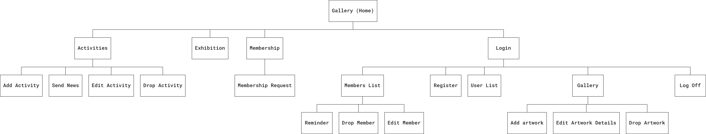

- [MSP3_club_membership](#msp3-club-membership)
  * [UX](#ux)
    + [User Stories](#user-stories)
    + [Strategy](#strategy)
    + [Scope](#scope)
    + [Structure](#structure)
    + [Skeleton](#skeleton)
    + [Surface](#surface)
  * [Features](#features)
    + [Existing Features](#existing-features)
    + [Features Left to Implement](#features-left-to-implement)
  * [Technologies Used](#technologies-used)
  * [Testing](#testing)
  * [Deployment](#deployment)
    + [Cloning repository using command line](#cloning-repository-using-command-line)
    + [Preparation of configuration files.](#preparation-of-configuration-files)
    + [Creating an env.py file](#creating-an-envpy-file)
    + [Creating file .gitignore](#creating-file-gitignore)
    + [Deployment to Heroku.](#deployment-to-heroku)
    + [Heroku application to run](#heroku-application-to-run)
  * [Credits](#credits)
    + [Content](#content)
    + [Media](#media)
    + [Acknowledgements](#acknowledgements)

_[TOC](http://ecotrust-canada.github.io/markdown-toc/)_


# MSP3_club_membership

A project designed to capture and collect membership details for an art club.
This will enable the art club to stay in touch with its members and organise activities that the members will be interested in.
It is hoped to be a help with the annual summer exhibition of member's works, providing a listing of each year's contributions.
A volunteer roster for the exhibition would be easier to set up.
Evening and weekend activities set up by the members, for the members, at other times of the year would be recorded.
Club administrators will be able to keep up-to-date contact details, creating, updating and deleting lapsed memberships.

## UX
--- 
### User Stories
1. As an art enthusiast I would like to join like-minded people in my local community.
2. As a member I would like to submit my work for the annual summer exhibition.
3. As a member I would like to flag my interest in a forthcoming event.
4. As a club administrator I would like to be able to contact paid members to inform of new activities and developments within the club.
5. As a club administrator I would like to remind members of forthcoming club dues and subscriptions.

### Strategy

A local collection of artists and art enthusiasts would like an online presence, or focal point to share their enthusiasm.

The casual browser of the site should be shown members' artworks that would entice further membership applications.

Another encouragement is the list of club activities run throughout the year to encourage club participation.

With that in mind, provide an initial membership request form.

From the request form the administrative processes emerge of reporting, updating and, if need be, deleting lapsed art club members.
Administrators also need the ability to enter membership details if the requestor does not have access to the web site.

Administrators also need to administer members' artworks, what to display, what details are relevant for exhibition, or potential sale of the members' work.

Administrators need to enter, refine and delete past club activities for the members (and casual browsers) to attend to encourage their interest in local art.


### Scope

The minimum viable product would be the ability to record membership and show artwork in some easy to view way.

#### Functional Specification.
Following administrative Create, Read, Update and Delete (CRUD) procedures for membership and artworks. 
* Storing membership details with limited access. 
* Associate the members with details, including stored images, of their work.
* Ability to display club members work.
* Facility to publicise events and activities run by club members.
* Login and logout to limit CRUD procedures to administrators only.
* Ability to search for artworks on title or artist.

#### Content Requirements.

Members details, such as email address, last subscription paid, what their interests are in art.
Where, when and what club activities are to take place.
Where and when the summer exhibition will be held this year.
Artworks, their images, titles and who made them are to be held for view.

### Structure

#### The interaction design 





This is to have a navigation bar for each page:
-  a 'gallery' of members' works being the initial link,
- then a link to club activities, 
- then a link to exhibition work,
- a link to apply for art club membership,
- then a login option for administrators.

For accessibility the navigation will change to a sidebar for mobile viewports.

A coherent visual display across all pages should be presented to the browser of the site.
 With a header showing the identity of the art club, and a footer with links to social media and other sites of interest.

The membership application form's number of input fields will be kept to a minimum. 
This is to keep the applicant's experience as clear and concise as possible.
The onus then is on the administrator to 'fill in the blanks' when needed.

The casual browser of the site will be presented with images of club member's artworks to scroll through.

Initially the artworks would be presented on a carousel, but this was dropped in favour of a more classic scroll-down.

They will have an option on the navigation bar to apply for membership.

A logged-in administrator has further options to:
- maintain a member's list.
- maintain artworks details.
- add and remove artworks from the exhibition page.
- maintain the club activities page.


#### The information architecture

The first priority for the casual user would be the examples of the current club member's art on display.
Artwork images, who made them, how large are the works, what price (if any) are they?
This would act as an advertisement for the club.
From there an opportunity to join the club. 

Club members would like to see their exhibition work and what activities are planned for the rest of the year.

For the club administrators the priority will be one of collection of data holding member contact details and a bried description of their work or motivations ('bio').

A collection of artworks will have Boolean indicators as to whether they were for exhibit as well as gallery, whether they are already sold, or 'NFS' not for sale.

The  exhibition collection would contain details such as location and dates of the annual exhibition for that year.

The activities collection will hold the date and time the activity will take place, an image to publicise the event, along with venue,
         duration and who will be leading the activity.
         
With club administrators needing secured access to members details their login authentication details would be collected as 'users'.

There will be a need for text indexes on collections to ease searches. [Create indexes](static/docs/indexes.md)

The decision is made to store images externally to the database, with the database holding the image location on the server.
      An example discussion of this issue [Images on database?](https://habiletechnologies.com/blog/better-saving-files-database-file-system/)

### Skeleton

#### Interface Design
* Public link to wireframes used as mockups : [Balsamiq](https://balsamiq.cloud/)

Gallery large screen


Gallery small screen


Activities large screen


Activities small screen


Exhibition large screen


Exhibition small screen


Membership Request large screen - 'apply to join'


Membership Request small screen - 'apply to join'


Members List large screen


Members List small screen


* [Wireframes in PDF](static/docs/club_administration.pdf) are provided covering a number of different sized viewports.

#### Navigation Design

There are three types of user of the site identified.

Visitors and members are first presented with a gallery page of club members works.

Administrators, once logged in, are presented with the Members List page.

Casual browsers of the site can then navigate to club activities details, exhibition display or apply for membership.

Members have the same options, but at the discretion of the club administrators could login to the site to amend their artworks and membership details.

Club Administrors have login access and from login can create, read, update and delete member details, activity details and artwork details (CRUD).


#### Information Design


Artworks collection would contain the title of the piece, the artist's name who made the piece, the price (if any) of the piece, the height and width of the piece,
and whether it is to be exhibited that year.

Members collection would contain forename, surname, email address and optionally phone number.
A member may be wanting membership for their family as well.
Club administrators would also like to know whether the member is a 'guest', i.e. not qualifying for club subscription fees.
The member collection would also contain a brief description or 'biography' of the member.

Exhibition would contain the location and start and end dates for that coming year.

Club activities would need the title, date, start time and duration and the leader of the artivity, whether a club member, or a guest.


### Surface

* The backround colour for the header and footer will be the muted pale blue of #D9E6F3.
* The font chosen will be Roboto.
* The 'coherent visual display' will be provided by the MaterializeCSS framework.
* Any delete/drop (cruD) button should be coloured red.


## Features
---
The project concerns club membership, club activities, an annual exhibition and a record of artists works.
 
### Existing Features
- Membership application form. Both client and server side validation for 'belt-and-braces' defensive programming.
- Create, update and delete 'CRUD' buttons only displayed when administrator logged in. 
- Members list of club members details for club administrators, with search facility, if club becomes popular.
- Subscriptions - allows a logged-in user to gain a list of members whose subscriptions are due.
              This list excludes those marked in the database collection 'members' as paid or the members are guests (no subscription).
- Subscriptions - allows administrator to send email reminders to members when subscriptions are due.
- Applications - allows administrator to ascertain new applications and add information to become member.
- Flag interest in activities - displays a count against each activity of interest shown.
- Exhibition page showns images and artist names of all artworks flagged for exhibit in club's annual exhibition.
- Gallery page shows all artworks of members, whether for exhibition, or not. 
    also shows whether an artwork has been sold.
- Search facility for members artworks, search against index of artist name or artwork title.

### Features Left to Implement
- A volunteer rosta for running the annual exhibition.
- An administrator's view of those interested in activities. To inform of cancelations, etc.
- A batch script to archive older artworks that have exhibited in previous years, have been sold, or by lapsed members.
- A cleaner, clearer procedure to ensure images arrive correctly on the server and recorded on artwork and member forms.
  Possibly utilizing an application such as [cloudinary](https://cloudinary.com/documentation).
- As the number of club activities increase, and the number of exhibition artworks increase, 
  there will be a need for limiting the intial page loads and implementation of pagination.

#### Features Testing has shown left to implement.    
- Further client-side confirmation of deletions (members, activities and artworks) for administrators.
- Date validation, especially validating against entering dates in the past.
- Email reminders of membership dues needs some refinement. 
  A member can be enmailed, but the email not recorded against the member's document.
- Email news of activities to all members at once, rather than one member at a time.


## Technologies Used
---
- [JavaScript](https://www.javascript.com/)
    - For dynamic, front-end interaction on HTML forms.

- [JQuery](https://jquery.com)
    - The project uses **JQuery** to simplify DOM manipulation and initialise MaterializeCSS components.

- [EmailJS API](https://www.emailjs.com/)
    - Third party email service to help club administrators remind members when their subscriptions are due.    

- [Python 3](https://www.python.org/about/)    
    - Programming language used to interact with a MongoDB database
    - Password security via [werkzeug WSGI library](https://werkzeug.palletsprojects.com/en/1.0.x/utils/#module-werkzeug.security)
    - [PyMongo library](https://pymongo.readthedocs.io/en/stable/index.html) used to link Python with MongoDB Atlas.
    - [Docstring PEP 257](https://www.python.org/dev/peps/pep-0257/) documentation convention followed.

- [Flask Framework](https://flask.palletsprojects.com/en/1.1.x/)
    - A python framework that uses **[JINJA](https://www.fullstackpython.com/jinja2.html)** template engine.

- [Materialize Framework](https://materializecss.com/)
    - A front-end, responsive design framework with a unified 'look and feel'.
    - Using a [date picker](https://materializecss.com/pickers.html)

- [Font Awesome](https://fontawesome.com/) 
    - to provide additional icons, especially 'facebook'.

- [DB Diagram](https://dbdiagram.io/)
    - to provide visual database schema.

- [Balsamiq](https://balsamiq.cloud/)
    - to provide wireframes and site map.

- [MongoDB Atlas](https://www.mongodb.com/cloud/atlas)
    -  Global cloud database service.

- [Online Image Compressor](http://jpeg-optimizer.com/)
    - to optimise speed of website loading on an image intensive site.    

- [TOC for markdown](https://ecotrust-canada.github.io/markdown-toc/) to generate table of contents for README     

## Testing
---
For the sake of brevity, the testing documentation has been separated and linked to a [TESTING document](testing/TESTING.md).

### HTML Validated
- [W3.org Validator for home page](https://validator.w3.org/nu/?doc=https%3A%2F%2Fmsp3-club-membership.herokuapp.com%2F#l275c9)
- [W3.org Validator for activities](https://validator.w3.org/nu/?doc=https%3A%2F%2Fmsp3-club-membership.herokuapp.com%2Factivities#l110c55)
- [W3.org Validator for exhibition](https://validator.w3.org/nu/?doc=https%3A%2F%2Fmsp3-club-membership.herokuapp.com%2Fexhibition#l104c25)
- [W3.org Validator for gallery](https://validator.w3.org/nu/?doc=http%3A%2F%2Fmsp3-club-membership.herokuapp.com%2Fgallery#l275c9)
- [W3.org Validator for login](https://validator.w3.org/nu/?doc=https%3A%2F%2Fmsp3-club-membership.herokuapp.com%2Flogin#l275c9)
- [W3.org Validator for members](https://validator.w3.org/nu/?doc=http%3A%2F%2Fmsp3-club-membership.herokuapp.com%2Fmembers#l275c9)
- [W3.org Validator for membership](https://validator.w3.org/nu/?doc=http%3A%2F%2Fmsp3-club-membership.herokuapp.com%2Fmembership#l275c9)
- [W3.org Validator for register](https://validator.w3.org/nu/?doc=https%3A%2F%2Fmsp3-club-membership.herokuapp.com%2Fregister#l275c9)
- [W3.org Validator for reminder](https://validator.w3.org/nu/?doc=http%3A%2F%2Fmsp3-club-membership.herokuapp.com%2Freminder%2F5f9af26bc6bb7b1a91fdadeb#l275c9)
- [W3.org Validator for users](https://validator.w3.org/nu/?doc=https%3A%2F%2Fmsp3-club-membership.herokuapp.com%2Fusers#l275c9)

### CSS Validated
[W3C Validator](https://jigsaw.w3.org/css-validator) By Direct Input, of copied 'stylesheet.css'.

- 


### JavaScript tidied
Passed [code](../static/js/script.js) through [JSHint](https://jshint.com/about/)

#### Metrics

>There are 32 functions in this file.
>Function with the largest signature take 1 arguments, while the median is 0.
>Largest function has 15 statements in it, while the median is 3.5.
>The most complex function has a cyclomatic complexity value of 3 while the median is 1.


### PEP8 compliant python code
Passed code through [PEP8](http://pep8online.com/).
Especially for long lines [PEP8 long lines](https://www.python.org/dev/peps/pep-0008/#maximum-line-length)

    
## Deployment
---
Developed on GitPod using git and GitHub.
Gitpod repository has already been created, MSP3_club_membership, master git branch.

### Command line execution.
The application can be run in the workspace from python script club_admin.py :
``` python3 club_admin.py ```

### Cloning repository using command line
Following the process documented in [cloning a repository](https://help.github.com/en/github/creating-cloning-and-archiving-repositories/cloning-a-repository ).

To run this code on your local machine, you would go to my repository at [My Repo](https://github.com/mikedjgreen/MSP3_club_membership) on GitHub :
``` https://github.com/mikedjgreen/MSP3_club_membership ```

On the home page on the right hand side just above all the files, you will see a button that says, "Code".


This button will give you options to clone with HTTPS, SSH, GitHub CLI, open in desktop or download as a zip file.
I initially selected GitHub CLI.


I had downloaded GitHub CLI to the default : C:\Program Files\GitHub CLI\ on my Windows terminal, from [Download CLI](https://cli.github.com/).
You will need Windows 64bit to use the software, I had a 32bit laptop...

I have selected HTTPS instead.


To continue with cloning, you would:
- Open Git Bash (GitPod's 'Terminal')
- Change the current working directory to the location where you want the cloned directory to be made. (e.g. /workspace/clone_test )
- Type git clone, and then paste the url copied from above, either GitHub CLI or HTTPS.
 ```git clone https://github.com/mikedjgreen/MSP3_club_membership.git```
Press Enter. Your local clone will be created.


### Preparation of configuration files.

- requirements.txt created within the gitpod terminal :``` $ pip3 freeze --local > requirements.txt ```
- Procfile (case-specific) created within the gitpod terminal:``` $ echo web: python club_admin.py > Procfile ```

Push these files to repository, as they will be picked up by the Heroku application below.

### Creating an env.py file

Environment variables needed by the server application need to be recorded.

```
import os

os.environ.setdefault("IP", "0.0.0.0")
os.environ.setdefault("PORT", "5000")
os.environ.setdefault("SECRET_KEY", "***************")
os.environ.setdefault("MONGO_URI", "***********")
os.environ.setdefault("MONGO_DBNAME", "*******") 
```

### Creating file .gitignore

The file above contains sensitive keys and passwords, so need to be ignored by GitHub's push.

```
core.Microsoft*
core.mongo*
core.python*
env.py
__pycache__/
*.py[cod]
```

### Deployment to Heroku.

Register a Heroku account.

Create new app ('msp3-club-membership') with an appropriately close region (Europe).


From Heroku's deploy tab the GitHub deployment method was selected.

The github connection searched for mikedjgreen's repository 'MSP3_club_membership'.

From Heroku's settings tab, select 'Reveal Config Vars'.
Add the key:value pairs with the same settings as the 'env.py' file above. (No quotes).

- IP, 0.0.0.0
- PORT, 5000
- SECRET_KEY, <whatever>
- MONGO_URI, *************...
- MONGO_DBNAME, ******

Back to Heroku's deploy tab to ensure that Heroku's app picks up the GitHub's latest repository.


### Heroku application to run

[club membership app](https://msp3-club-membership.herokuapp.com/)


## Credits
---
### Content
- The text, for better or worse, is my own.

### Media
- The photos used in this site were obtained from my own work.

### Acknowledgements

- I received inspiration for this project from [Ely Art Society](https://www.elyartsociety.com/).
- The coding instruction was gratefully received from [Code Institute](https://codeinstitute.net/)
- Further help was found with [w3schools](https://www.w3schools.com/default.asp)
- More advanced MongoDB queries were garnered from [MongoDB University](https://university.mongodb.com/courses/M001/about)
- Thanks to mentor, Jonathan Munz, for pointing me to database image store debate article.