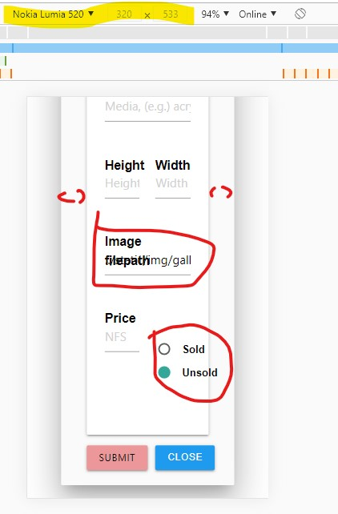

# Testing MSP3_club_membership.

Separate testing documentation, linked to [README](../README.md)

## Initial Lighthouse Report.

[Lighthouse report 1](../testing/lighthouse_20201104_1413.html)

- Adjusted the label font weight within css to fix:
    "Background and foreground colors do not have a sufficient contrast ratio."
    Introduced class ```inputlabel```.
- Added missing ```<alt>``` attributes to images.    
- ' Form elements do not have associated labels ' was fixed.
- A link from an image did 'not have a discernible name', amended to redirect to membership page.

## Navigation bar getting 'busy'.

In attempting to add menu options following CRUD processes for administrators, the navigation bars for both small and large viewports were getting congested.
A redesign of the navigation bar with further drop-down options is called for.

- [Large viewport navigation](../testing/screenshots/navbar_user_busy_1.jpg)

- [Small viewport navigation](../testing/screenshots/navbar_user_busy_2.jpg)


## Membership form validation.

Currently the membership entry form validates at the server side only. So any invalid entries are only caught once a submission is attempted.
Also only the initial input error is indicated, not many.

- [First input error](../testing/screenshots/membership_validation_serverside_1.jpg) only error indicated on selecting Submit button.
- [Second input error](../testing/screenshots/membership_validation_serverside_2.jpg) only shown once first input error has been amended and submitted.
- [Third input error](../testing/screenshots/membership_validation_serverside_3.jpg) again only shown once previous errors amended and submitted.

## Adding artworks into Gallery collection.

Initially tested [MaterializeCSS Carousel](https://materializecss.com/carousel.html) of artwork images and details within the Gallery page and collection.
It is designed as an image slider and is touch compatible. The initial test had no direction buttons.
Mouse slide:
- [Art works carousel](../testing/screenshots/Artworks_carousel_1.jpg)
- [Art works carousel](../testing/screenshots/Artworks_carousel_2.jpg)
- [Art works carousel](../testing/screenshots/Artworks_carousel_3.jpg)

Added initial artworks as an array into the Gallery documents, by using a [python script](../testing/artworks_insert.py). 
To work properly the script will have to be moved back to the IDE's root directory, rather than the testing subdirectory.

Added an artwork entry to an artworks array within a gallery document.

- [Initial Modal form](../testing/screenshots/Add_artwork_1.jpg)
- [Art work details filled](../testing/screenshots/Add_artwork_2.jpg)
- [Successfully added](../testing/screenshots/Add_artwork_3.jpg)  viewed at 50% zoom.
- [Gallery view](../testing/screenshots/Add_artwork_4.jpg) viewed at 50% zoom.
- [Database view](../testing/screenshots/Add_artwork_5.jpg)

### Findings of initial artwork entry test
Although the entry form displayed well, it is too narrow for the image file entry.
On a normal monitor screen at 100% zoom, the screen estate is not used well, and depends upon vertical scrolling.
- [Screen Estate issues](../testing/screenshots/Add_artwork_6.jpg)

This becomes more pronounced on the smallest viewports...
- 

The art work was successfully added, as the flash message advises, but the user was not returned to  the gallery page.
The art work form can be closed without entry, but does not seem to take advantage of MaterializeCSS's documented process.