- [Testing MSP3_club_membership](#testing-msp3-club-membership)
  * [Feature Testing](#feature-testing)
    + [Navigation bar getting 'busy'](#navigation-bar-getting--busy-)
    + [Sending news of club activities](#sending-news-of-club-activities)
      - [Activity news findings](#activity-news-findings)
    + [CRUD Features for logged in administrators](#crud-features-for-logged-in-administrators)
      - [Drop member](#drop-member)
      - [Findings of dropping art club member.](#findings-of-dropping-art-club-member)
      - [Adding activities](#adding-activities)
      - [Client-side form validation](#client-side-form-validation)
      - [Findings of activity client-side validation.](#findings-of-activity-client-side-validation)
      - [Editing Activities.](#editing-activities)
      - [Client-side validation for edit activities.](#client-side-validation-for-edit-activities)
      - [Findings for editing activities.](#findings-for-editing-activities)
      - [Deleting activities.](#deleting-activities)
      - [Findings from dropping activity.](#findings-from-dropping-activity)
      - [Findings of initial artwork entry test](#findings-of-initial-artwork-entry-test)
      - [Edit Artworks](#edit-artworks)
      - [Finding of editing artwork.](#finding-of-editing-artwork)
      - [Deleting artworks](#deleting-artworks)
      - [Findings of deleting artwork.](#findings-of-deleting-artwork)
  * [Bug Testing](#bug-testing)
    + [Experiencing some load speed issues](#experiencing-some-load-speed-issues)
      - [Size of Image Files](#size-of-image-files)
    + [Membership form validation](#membership-form-validation)
      - [Client-side form validation](#client-side-form-validation-1)
    + [Editing member's details](#editing-member-s-details)
      - [Findings of member edit](#findings-of-member-edit)
  * [User Story Testing](#user-story-testing)
    + [1 As an art enthusiast I would like to join like-minded people in my local community](#1-as-an-art-enthusiast-i-would-like-to-join-like-minded-people-in-my-local-community)
      - [Membership application](#membership-application)
      - [Findings of membership applications](#findings-of-membership-applications)
    + [2 As a member I would like to submit my work for the annual summer exhibition](#2-as-a-member-i-would-like-to-submit-my-work-for-the-annual-summer-exhibition)
    + [3 As a member I would like to flag my interest in a forthcoming event](#3-as-a-member-i-would-like-to-flag-my-interest-in-a-forthcoming-event)
      - [Findings of initial activity interest flag](#findings-of-initial-activity-interest-flag)
    + [4 As a club administrator I would like to be able to contact paid members to inform of new activities and developments within the club](#4-as-a-club-administrator-i-would-like-to-be-able-to-contact-paid-members-to-inform-of-new-activities-and-developments-within-the-club)
      - [EmailJS for Activities News](#emailjs-for-activities-news)
      - [Findings of initial EmailJS News implementation](#findings-of-initial-emailjs-news-implementation)
      - [EmailJS News fixes](#emailjs-news-fixes)
    + [5. As a club administrator I would like to remind members of forthcoming club dues and subscriptions](#5-as-a-club-administrator-i-would-like-to-remind-members-of-forthcoming-club-dues-and-subscriptions)
        * [Implementation of EmailJS API for subscription reminders](#implementation-of-emailjs-api-for-subscription-reminders)
      - [Findings of initial EmailJS implementation](#findings-of-initial-emailjs-implementation)
      - [EmailJS fixes](#emailjs-fixes)
      - [Further EmailJS implementation and fixes](#further-emailjs-implementation-and-fixes)
      - [Some outstanding procedural issues with reminders](#some-outstanding-procedural-issues-with-reminders)
  * [PEP8 compliant python code](#pep8-compliant-python-code)
  * [Lighthouse Report](#lighthouse-report)
    + [Second Lighthouse Report](#second-lighthouse-report)
      - [Best Practices](#best-practices)
      - [Performance](#performance)
      - [Lazy Loading](#lazy-loading)
      - [Size images](#size-images)
      - [Render blocking resources](#render-blocking-resources)
  * [Test Scripts](#test-scripts)
  * [Responsiveness Testing](#responsiveness-testing)
    + [Testing different screen sizes](#testing-different-screen-sizes)


_[TOC](http://ecotrust-canada.github.io/markdown-toc/)_


# Testing MSP3_club_membership

Separate testing documentation, linked to [README](../README.md)

## Feature Testing

### Navigation bar getting 'busy'

In attempting to add menu options following CRUD processes for administrators, the navigation bars for both small and large viewports were getting congested.
A redesign of the navigation bar with further drop-down options is called for.

- 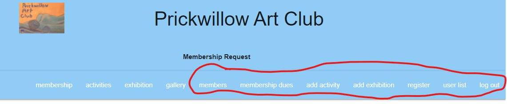

- 

### Sending news of club activities

When logged in as an administrator, each activity has the option to send emails giving details of the activity to paid-up members.

- 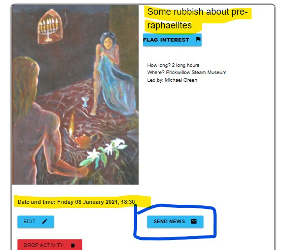

So a page is displayed with activity details and target member.
- 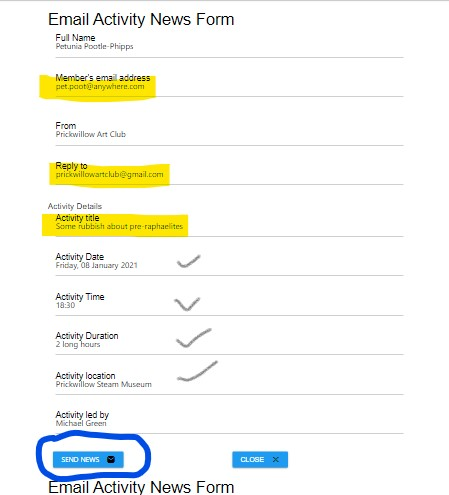

Unfortunately each individual member has to be selected separately.
- 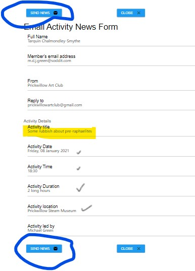

For each member the email does contain the details the club wants to inform them about.
- 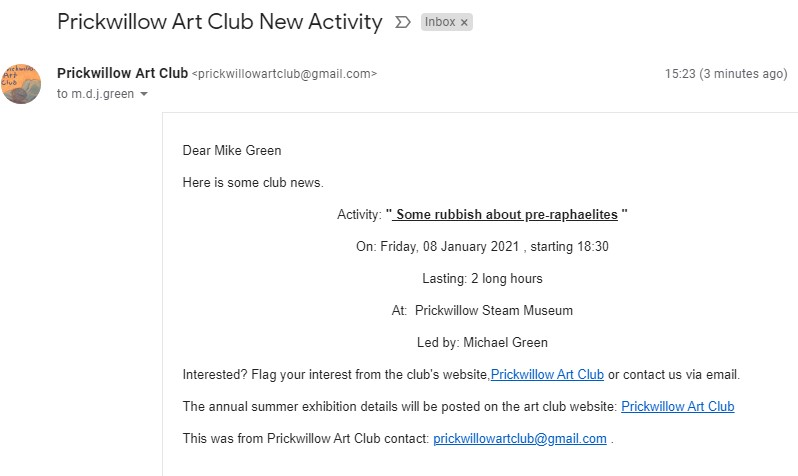

There is no record of an email being set against the activity.
- 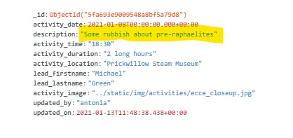

#### Activity news findings
1. There is a need for one email button to send emails of activity news to each paid-up member at once.
2. There is a need to keep track of emails news of an activity being sent, to prevent multiple emails ('spam').


### CRUD Features for logged in administrators

#### Drop member

There comes a time when a membership lapses, or an error in application has occured.

- 

- 

- 

- 


#### Findings of dropping art club member.
1. The lack of confirmation and terse feedback message leaves the administrator open to deleting the wrong member by mistake.

#### Adding activities
As with original membership application form validation, so with an administrator's new activity form, it is currently server-side validation only.

- 
    The initial invalid entry is marked, but the rest of the form can still be filled in, and sent to the server for validation.
    Would be better to capture each invalid entry at the client side.

- 
    Not all the fields have been validated by the server-side. 
    Invalid (past) dates are allowed and terse locations.
    Duration of activity should have a unit of measure.

#### Client-side form validation

Introduced javascripted client-side validation to adding activity form.
Using javascript's [regular expression](https://www.w3schools.com/js/js_regexp.asp) object to test for  a duration containing hour or minute.

- 
    The date of the activity can still be set to a past date.
    Focus remains at the captured error, and an indication of what is invalid displayed.

- 
    The duration having been corrected, the location is now found to be invalid.

- 
    Again the invalid field retains focus, before moving to next field to answer.

- 
    Currently the validated form is submitted, and a blank new activity form displayed.
    Inspecting the newly entered activity on the activities list shows that the date is wrong, and no image associated.
    These can be edited.
- 
    The details of the new activity unfortunately does not show the location, that was set on the form.

#### Findings of activity client-side validation.

- 

1. Date validation still needs to be implemented.
2. Investigation needs to be done on missing location entry.
3. Need to test that an activity image can be added.

#### Editing Activities.   
Another administrative, CRUD, procedure is to be able to amend a posted club activity.

- 
    Shows that the activity needs an image.

-     
    Pre amendment, the database also does not show the location of the activity.

- 
    The image file name and relative path has been manually entered. 
    This is the part that [cloudinary](https://cloudinary.com/documentation) may improve.
    The location field is not populated, as found above.

- 
    The edit form submitted, the resulting edited activity is returned, with the image and location displayed.
    Went back to amend the activity date from 2020 to 2021.

-     
    The edit form successfully amended details on the database document.

- 
    **There is little or no client-side validation of the edit activity form.**

#### Client-side validation for edit activities.

- 

- 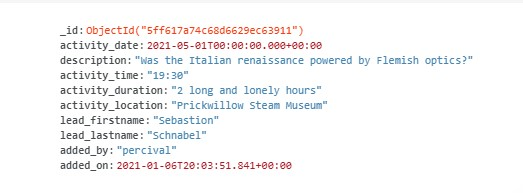

- 
    The edit activity form, amended for client-side validation shows successful captures,
     but also a flaw displaying activity date.

- 
    The edit completes, but the activity date is still not displayed.

- 
    Edit form successfully amends database.

#### Findings for editing activities.

Although the client side validation has been introduced,**a bug has entered the works**.
1. Activity Date will not display properly.
2. An activity image can be added, but the server's image file and pathname must be known.

#### Deleting activities.

Past activities need to be cleared from the activity list.

- 
    A dummy activity has been added to the database to test deletion.

- 
    
    The database document view.

- 
    The only feedback from dropping the activity is a terse flash message.


#### Findings from dropping activity.

The deleting of an activity itself had no errors. 
1. However, the lack of confirmation and terse feedback message leaves the administrator open to deleting the wrong activity by mistake.
2. In the future it may be better to archive the past activity, for future reference. Especially if it is an instructional session with reference documentation to store.


#### Findings of initial artwork entry test
Although the entry form displayed well, it is too narrow for the image file entry.
On a normal monitor screen at 100% zoom, the screen estate is not used well, and depends upon vertical scrolling.
- 

This becomes more pronounced on the smallest viewports...
- 

The art work was successfully added, as the flash message advises, but the user was not returned to  the gallery page.
The art work form can be closed without entry, but does not seem to take advantage of MaterializeCSS's documented process.

#### Edit Artworks

- 

    Artwork selected to edit. Has no image. Has been sold.

- 

- 

    There is no client-side validation.
    The order of the close and edit buttons need to be reversed.

 -   
   
   Server-side validation of dimensions enforced.

 -  

    Amended details made it to the database.

- 

    - The artwork was searched for by title.
    - The 'Sold' indicator was correct.
    - The image displayed as did the other amendments.

#### Finding of editing artwork.
The artwork is amendable.
1. There is no client-side validation.
2. The image name and location on the server needs to be known before entry.
3. The close and submit buttons are in reverse to othersite forms.

#### Deleting artworks

A search for an artwork via title 'Little Devils' revealed a possible duplication, 
and therefore candidate for deletion.

- 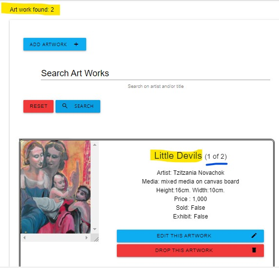

- 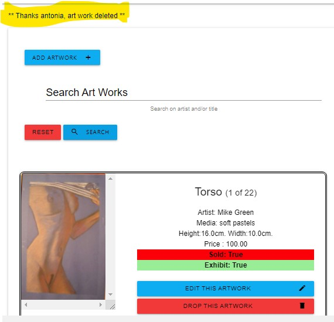

    The artwork deleted, the administrator is taken back to the first artwork entry of the gallery list.

- 

    Only one artwork title of 'Little Devils' remains. 

-    

    The administrator searched for the same title again. Only one artwork returned.

#### Findings of deleting artwork.

The deletion was successful.
1. As with dropping activity, the lack of confirmation and terse feedback message leaves the administrator open to deleting the wrong artwork by mistake.
2. This example test was obviously a duplication, but there is a need to archive rather than delete artworks, even if they are sold and unexhibited.


---
## Bug Testing

### Experiencing some load speed issues

#### Size of Image Files
Elected to reduce the size of the image files that may be degrading performance.
Using an [Online Image Compressor](http://jpeg-optimizer.com/).

- The initial compression  reduced the largest image file by over 75%.
- On the filestore this would be substantial savings  in space.
- On inspection the optimised image  did not diminish in quality.
- The Exhibition page  with the compressed file appeared the same.

### Membership form validation

Currently the membership entry form validates at the server side only. So any invalid entries are only caught once a submission is attempted.
Also only the initial input error is indicated, not many.

- 
   Only error indicated on selecting Submit button.

- 
   Only shown once first input error has been amended and submitted.

-  
  Again only shown once previous errors amended and submitted.

#### Client-side form validation

Introduced javascript client side validation to the membership form to address issues above. 
Notably that an error is captured before the client attempts to fill another field.

- 
    Forename entered with only 1 character. Flagged as error, displaying red background.
    Focus returned to field in error.

-    
    As with forename, validation behaves the same way.

-  
    The email validation relies on regular expression matches.

- 
    Phone number validates on numeric digits and hyphens, no alpha characters.

-  
    All textual input fields deemed valid, ready to submit application.

- 
    The applicant gets feedback.

 Currently the applicant submitting a valid form is returned to the application form.
 It would be better if the applicant is now directed to an interesting page, such as 'gallery'.      

 
### Editing member's details

- 

- 

- 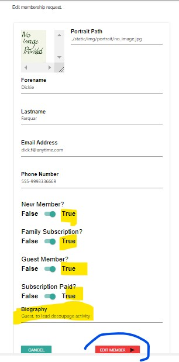

- 

- 

Unfortunately there is no effective client-side validation for editing a member.

- 

Even server-side validation did not catch error in phone number.

#### Findings of member edit

1. When entered properly the member's details can be altered on the database.
2. No client-side validation.
3. Server-side validation incomplete, allowed alphabetic phone number.
       

---
## User Story Testing

### 1 As an art enthusiast I would like to join like-minded people in my local community

#### Membership application

Tracing membership application to database and administration issues.

-  
    Details for initial club membership.
    Sally has asked for family membership subscription. 
    She has not been given the option to close the form without submission.

-  
    Details as seen on MongoDB Atlas. 
    There is no indication recorded of family subscription.

- . 
    A club administrator, 'antonia', checks for new applications made on the website.

- .
    The applicant is identified by the club administrator. 
    Additional information, such as a portrait can now be added.

- . 
    Unfortunately the club administrator has no indication the the applicant wants family  subscription.

- 
    Assuming administrator has been in contact with applicant, either by given phone number or email address,
    the relevant details are applied.

    There is a default 'no image' jpeg file for portraits if the applicant either does not  have an image or does not wish to have one shown.
- 
    The applicant's details are recorded on the database.

#### Findings of membership applications
1. The applicant's wish to have family subscription has not been initially recorded.
2. The applicant is not given the option to cancel their membership request on the form.
3. The image file associated with the membership is problematic. 
    There is an assumption that the administrator has the tools and know-how to add a given image file to the server in the appropriate path.
    Possibly this is a task left for the web administrator.
4. The application has been correctly identified to the club administrator, 
    and the applicant flag has been cleared once the applicant becomes a member.
---
### 2 As a member I would like to submit my work for the annual summer exhibition

A member may not neccesarily be a user able to login to edit an artwork. 
In this instance a club administrator with login access would submit the work on the member's behalf.

- 
    An artwork is searched for and found to be unsubmitted to exhibition.

- 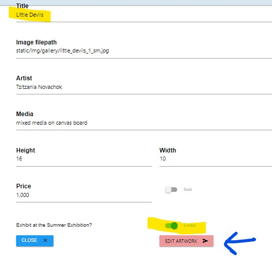
    The artwork's details are amended.

- 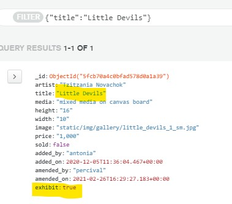  
    The underlying database entry for the artwork has the exhibit flag 'on'.

- 

    As well as the Gallery entry, the artwork now appears on the Exhibition page.


---
### 3 As a member I would like to flag my interest in a forthcoming event


The activities page contains a button to help a viewer indicate their interest in an event.
- 
The viewer is presented with a flag interest form.
- 
The viewer elects to indicate interest.
- 
The collection activities' document for the selected activity has had an interest recorded.
-  
The next interest shown in the activities overwrites the previous interest.
- 

#### Findings of initial activity interest flag
1. The form needs further styling.
2. The radio buttons do not record boolean values for membership.
3. A non-member's email entry is not recorded.
4. Once interest recorded, the user should be returned to the activities page.
5. The database entry should be organised in an array of interested parties.
6. The latest interest should not overwrite earlier interest in the activity.

---
### 4 As a club administrator I would like to be able to contact paid members to inform of new activities and developments within the club

#### EmailJS for Activities News

A personal email account was eschewed in favour of a generic club account name.
A button appears for a logged in administrative user for each activity.
- 

 This allows the administrator to view a form to be sent to each paid member of an activities details.
 - 

 The email is sent to the paid-up member of a new club activity's details.
 - 

#### Findings of initial EmailJS News implementation
1. Unlike the initial members' dues reminder, the activity news email used a generic club email account.
2. The email news option only appears for a logged-in administrator against each activity.
3. The date of the activity could appear more 'human' in both the email form and the eventual posting.
4. Although the activity has a lead member/organiser identified on the email form, the name does not appear on the posting to the member.
5. A count of the members with a qualifier of 'paid = true' matched the number of members appearing on the email news form.
6. Although the news email is actioned for a member, there is no ready indicator that the member has been sent a news email.
7. The functionality currently only allows one email to be sent to one member at a time.

#### EmailJS News fixes
1. The date of the activity appears more 'human' on the email form: .
2. The date is emailed to a member: 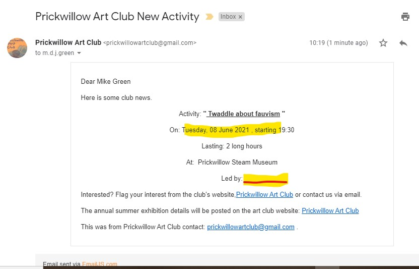.
3. The EmailJS documentation states 'total size of the dynamic variables cannot exceed 50kb' which may explain the loss of the 'led by' name. 
- [Restrictions](https://www.emailjs.com/docs/user-guide/dynamic-variables-templates/#restrictions)


---
### 5. As a club administrator I would like to remind members of forthcoming club dues and subscriptions

##### Implementation of EmailJS API for subscription reminders
The emailJS implementation is in response to this user story.
Simple process testing of the EmailJS showed some procedural and functional shortcomings.
The initial implementation attempted to use a personal gmail account. 
The API key was hardcoded into the javascript file, again not ideal.

The button to initiate email reminders appears on the membership page.
One problem is that this would appear to remind all members of their subscription renewals, whether they have paid, or not.
- 
The same email reminder button is also placed against each member entry.
- 
The  form that is opened by the button (against a paid member) contains the correct information, but is not labeled as such.
Also the email account used to send the email is a private email account.
- 
Closing the reminder form returns the administrator to the members page correctly.

Selecting 'Membership Dues' button takes the administrator to the membership dues list where the reminder emails are to be used.
- 

Selecting 'Send Reminders' now displays a member's details accurately, although the labels are still needed:
- 

For further testing of the email, the selected member's email account has been amended to one accessible for the test.
- 

This compares with the club's EmailJS template for members renewals.
- 

Unfortunately when another renewal member's email reminder is selected:
- 
..the first member on the due list is still selected..
- 

This leads to two failures, 
1. the inability to select members to remind by email.
2. once email sent, no flag set to stop duplicating email.

#### Findings of initial EmailJS implementation
1. EmailJS email service, although still a 'personal service', should be connected to a more club oriented email account.
2. The API key subsequently received should be recorded privately, if possible.
3. The Email Reminder should only be accessed against the membership dues list.
4. The reminder should pick up the member's detail(s) in the context it was called.
5. The reminder form should be labeled.
6. The reminder sent successfully, a flag should be set indicating that the member has been emailed with a reminder.

#### EmailJS fixes
1. The service is connected to a more club oriented account: .
4. The reminder should pick up the member in focus: 
            ...which leads to:    
5. The reminder form has been reconfigured:  .

#### Further EmailJS implementation and fixes
1. Flag is now set when a reminder has been sent.
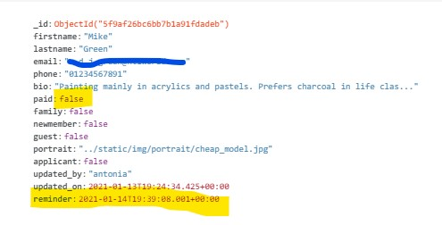.
2. When members' dues list has been selected, any members who have had an email reminder will be evident.
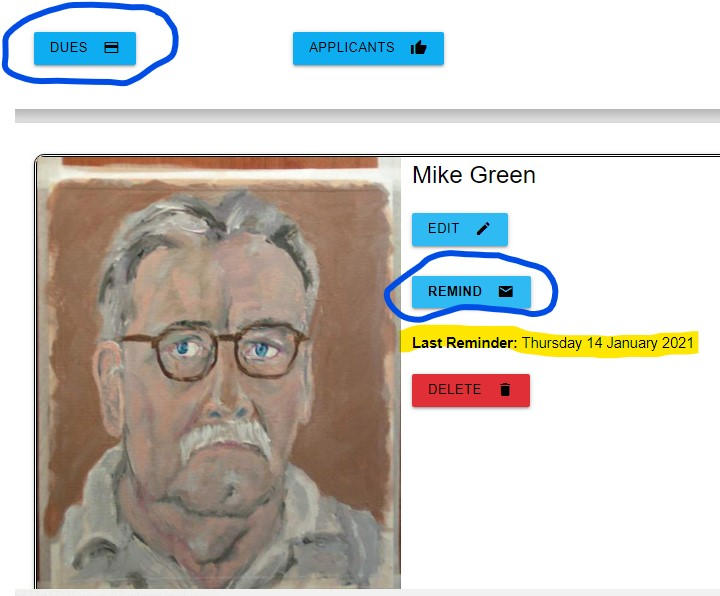
3. A member needs to be reminded of subscription due.
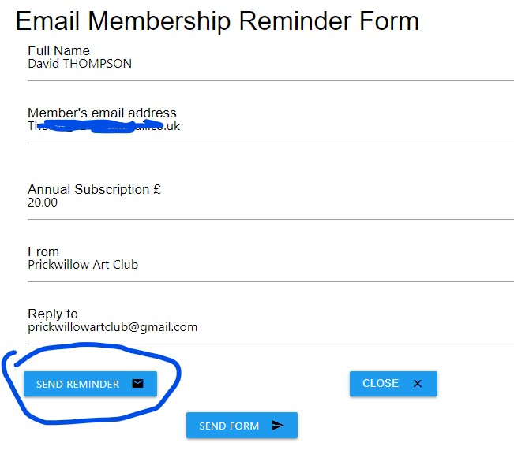
4. The procedure firstly emails the member with 'send reminder'.
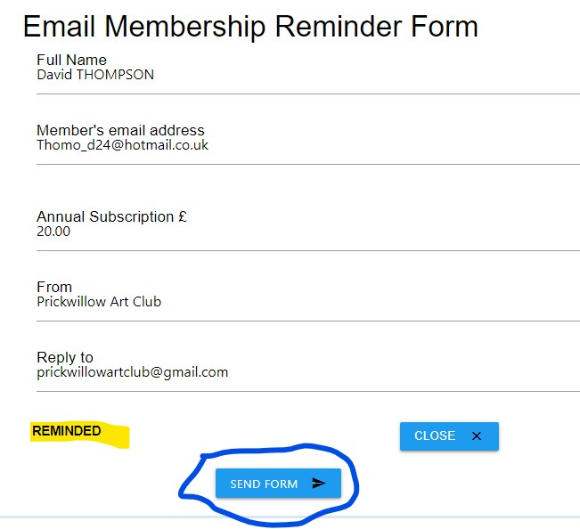
The button is thus removed to stop duplicated emails.
5. The reminder form is finally sent, to update the member's document.
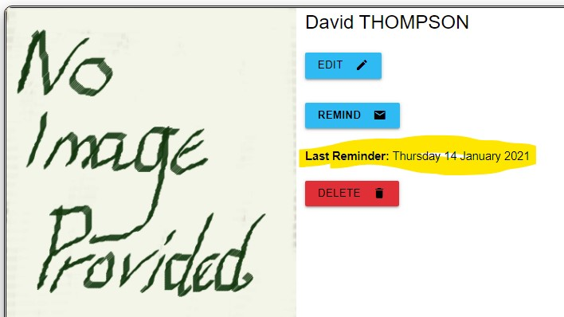

#### Some outstanding procedural issues with reminders
1. There is still scope for the email to be sent and the member's document not to be flagged as reminded.
The administrator is presented with a 'close' button on the reminder form at each stage, rather than at the start, and the removed when an email has been sent,
this will force an update of the member's document.


## PEP8 compliant python code
[PEP8 report](../testing/pep8_check_20201223.txt)


---
## Lighthouse Report

Using Chrome's Developer Tools [Lighthouse](https://developers.google.com/web/tools/lighthouse) to audit the site.
This gave me the following report.
[Lighthouse report 1](../testing/lighthouse_20201104_1413.html)

- Adjusted the label font weight within css to fix:
    "Background and foreground colors do not have a sufficient contrast ratio."
    Introduced class ```inputlabel```.
- Added missing ```<alt>``` attributes to images.    
- ' Form elements do not have associated labels ' was fixed.
- A link from an image did 'not have a discernible name', amended to redirect to membership page.

### Second Lighthouse Report

#### Best Practices

Followed Best Practices advice about 3rd part links using ```target="_blank"```.
Links to cross-origin destinations are unsafe.
[Links unsafe](https://web.dev/external-anchors-use-rel-noopener/?utm_source=lighthouse&utm_medium=devtools)
```rel="noopener"```

#### Performance

Lighthouse performance report, especially for gallery page was low, as low as score 28.

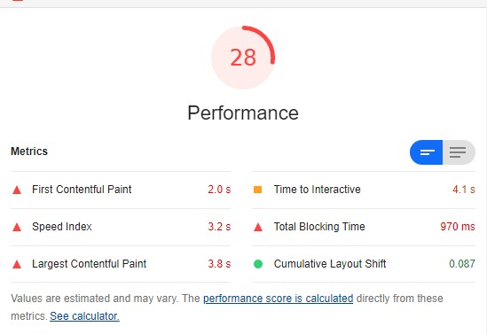

#### Lazy Loading
One opportunity the report provides to pursue is 'lazy-loading'.

[Lazy Loading](https://web.dev/native-lazy-loading/) such as:
```<img src="image.png" loading="lazy"```

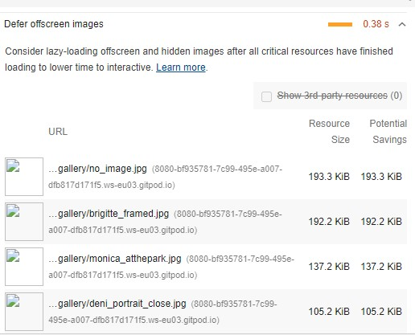

By installing lazy-loading the performance score  was raised to 55.


The 'defer offscreen images' audit was passed.
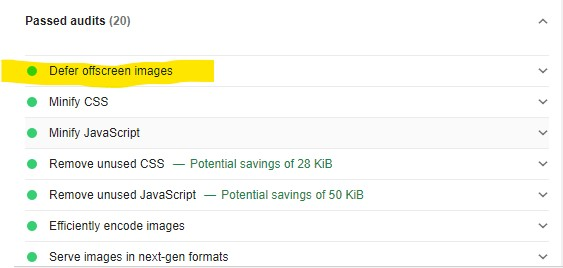

#### Size images
Another opportunity presented by the report is to properly size images.

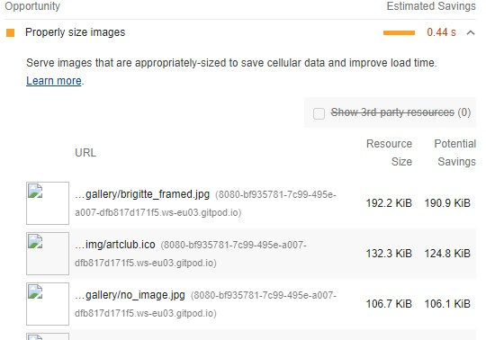

Used [jpeg optimzer](http://jpeg-optimizer.com/) to reduce the main images causing the performance degradation:
- to a width of 116px,
- renaming the images *_sm.jpg,
- editing the gallery artworks to pick up the *_sm.jpg images.
     Via the existing CRUD functionality.

This increased the performance score to 73.

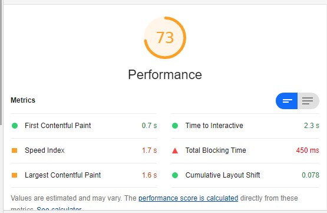

#### Render blocking resources
Another opportunity presented by the report is to eliminate render blocking resources.

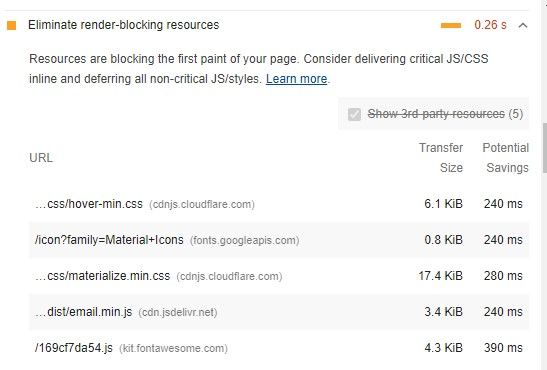

It identifies scripts and stylesheets that may slow down page loads.
Scripts should have boolean attribute ```async``` or ```defer``` set, without either, the page parsing is delayed.

---


## Test Scripts

A number of python scripts were written to populate, and if neccessary, repopulate the collections with test data.
These are found in the testing subdirectory:
- [Activities insert](../testing/activities_insert.py)
- [Activities CRUD menu](../testing/activities_crud_menu.py)
- [Artworks insert](../testing/artworks_insert.py)
- [Exhibition CRUD menu](../testing/exhibition_crud_menu.py)
- [Members insert](../testing/members_insert.py)
- [Members CRUD menu](../testing/members_crud_menu.py)

## Responsiveness Testing

Using [Am I Responsive](http://ami.responsivedesign.is/)

- 

Using URL: [Exhibition](https://msp3-club-membership.herokuapp.com/exhibition)

- 

Using URL: [Activities](https://msp3-club-membership.herokuapp.com/activities)

- 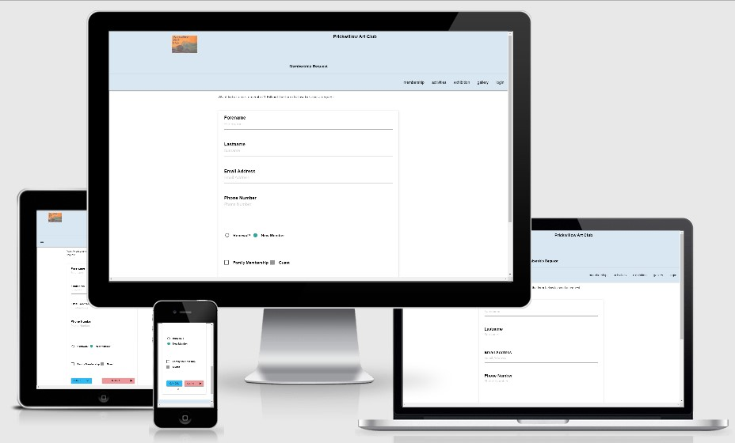

Using URL: [Membership](https://msp3-club-membership.herokuapp.com/membership)

### Testing different screen sizes

Chrome's Inspect emulator |	width	| breakpoint
--------------------------|---------|-------------
Nokia Lumia	|320px	|(default)
Nexus 7	    |600px	|s
iPad :	    |768px	|m
Kindle Fire:	        |800px|	m
iPad Pro:	            |1024px|	l
Laptop with MDPI screen	|1280px|	xl

